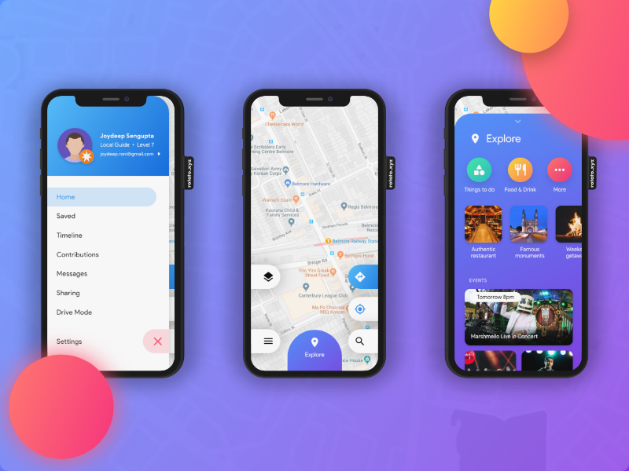

# 

# flutter_challenge_googlemaps

Use Flutter💪  to implement the UI challenge of Google Maps on [uplabs](https://www.uplabs.com/posts/google-maps-redesign-919dd0d6-0883-4378-b5b2-f77e36adb6b5) .

[中文版本](README_CN.md)

> Designer : [Joydeep Sengupta](https://www.uplabs.com/joydeeproni)
>
> Uplabs : <https://www.uplabs.com/posts/google-maps-redesign-919dd0d6-0883-4378-b5b2-f77e36adb6b5>
>
> Developer : [ditclear](https://github.com/ditclear)

#### DownLoad 

[demo.apk](apk/app.apk)

#### Introduction

| Branch                                                       | Description                                                  |
| ------------------------------------------------------------ | ------------------------------------------------------------ |
| [master](<https://github.com/flutter-ui-challenges/flutter_challenge_googlemaps>) | use `setState` to notify UI update                           |
| [provide](https://github.com/flutter-ui-challenges/flutter_challenge_googlemaps/tree/provide) | use  [flutter-provide](https://github.com/google/flutter-provide) to notify UI update |
| [desktop](https://github.com/flutter-ui-challenges/flutter_challenge_googlemaps/tree/desktop) | use [go-flutter](https://github.com/go-flutter-desktop/go-flutter) to implement UI on Desktop |

### Challenge 




#### 不用客气，buy Me a Lunch ~

[sponsor](https://github.com/flutter-ui-challenges/JoinUs/blob/master/sponsor.md)

### License

```
Copyright 2019 ditclear

Licensed under the Apache License, Version 2.0 (the "License");
you may not use this file except in compliance with the License.
You may obtain a copy of the License at

    http://www.apache.org/licenses/LICENSE-2.0

Unless required by applicable law or agreed to in writing, software
distributed under the License is distributed on an "AS IS" BASIS,
WITHOUT WARRANTIES OR CONDITIONS OF ANY KIND, either express or implied.
See the License for the specific language governing permissions and
limitations under the License.
```


